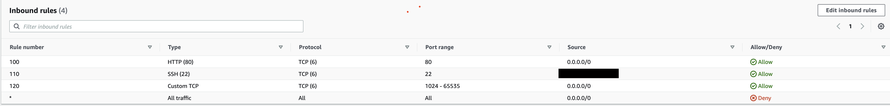
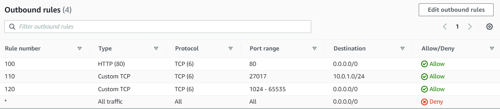
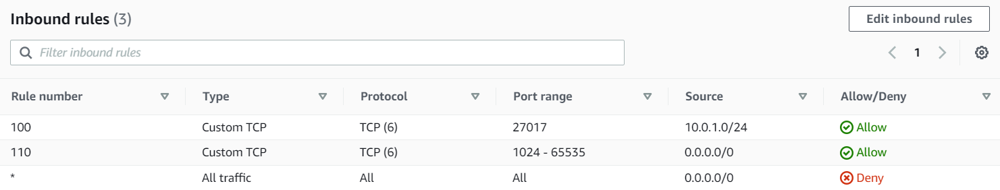
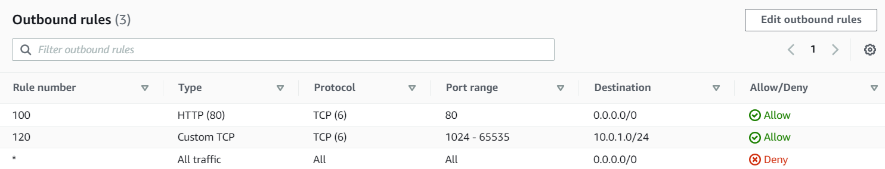

# AWS Virtual Private Cloud (VPC)

## AWS Regions
## AWS Availability Zones
Multi AZ - Deploying the application in multiple availability zones to achieve high availability. In case of a natural disaster destroys a data centre, it is still available on another one.
## Internet Gateway
## Subnets
### Route Tables
#### Network Access Control List (NACLs)
##### Security Groups

- What is VPC
- AWS isolated virtual network 
It allows us to control virtual network environment including selection of your own IP address range, we can create multiple subnets within one VPC with specific network configuration. We can use both IPv4 and IPv6 for most resources. It provides security for your services or instances.

- What is an Internet Gateway? 
It can transfer communications between an enterprise network and the internet. It allows internet access into the VPC.

- What is a Subnet? 
It is a segmented piece of a larger network - the goal of a subnet is to split a large network into a group of smaller interconnected networks to help minimise traffic - or navigate traffic securely.

- Route Table 
It contains a set of rules (routes), that are used to determine where the network traffic from your subnet or gateway is directed.

- Network Access Control List (NACL) 
NACLs are stateless- we have to explicitly allow inbound and outbound rules - they are an added layer of security ay subnet level

### Step 1: create a VPC with IP valid CIDR block
1. On the AWS Dashboard search for **VPC** and click on `Your VCP`.
2. Select `Create VPC`
3. Create a **Name tag** , add an **IPv4 CIDRblock** and click `Create VPC`
I will be using `10.0.0.0/16` for my IPv4 CIDR 
### Step 2: Create internet gateway
1.  Select `Internet Gateways` on the dashboard thenlect `Create Internet gateway` 
2. Add a Name tag then click `Create Internet Gateway` 
3. Select `action` and `Attach VPC`. Attach the VPC you created previously.
4. Select `Attach Internet Gateway`
### Step 3: Create route table
1. On the left hand toolbar click on `route table`
2. Create a route table 
3. Select the route table and click `Action` then `Edit routes`
4. Then add a destination and target. The target is the internet gateway created earlier. Then click `save routes`
5. Click on subnet associations and then `edit subnet associations`. Select the public subnet and click on save.
### Step 4: Create subnets
1. Click on `Subnet` onthe left toolbar then select `Create subnet` 
2. Create a public and private:
- Select the VPC you previously created 
- **Public**: CIDR block IP changes slightly by adding 1 instad of 0 in the 3rd octet:
`10.0.1.0/24` 
- **Private**: CIDR block IP changes slightly by adding 2 instad of 0 in the 3rd octet: `10.0.2.0/24`
4.1: Associate public subnet with our RT
### Step 5: Create public NACLs
1. On the left hand side toolbar under security click on Network ACLs and then click create network ACL.
2. Create a public and private NACL and select your VPC 
3. On the public nacl add the following inbound rules:

4. On the public nacl add the following outbound rules:

5.  In the `subnet associations` select the public subnet created earlier and select edit
6. On the private nacl add the following inbound rules:

7. On the private nacl add the following outbound rules:

### Step 6: Create EC2 instances (app and db)
1. Select an AMI
2. Choose created VPC for `Network`
3. Select appropriate `Subnet`
4. `Auto-assign public IP`: Enable for the public, disable for private
### Step 7: Create a security group for our app
#### App inbound: 

App outbound: allow all traffic to all destinations 
#### DB inbound: 

*Note: the app's private IP will change after restart*
DB outbound: allow all traffic to all destinations 
### Step 8: Connect to the app instance
Add the address of db instance to the env variables: 
`export DB_HOST=10.0.2.145:27017/posts/` 
Seed the database: `node seeds/seed.js` 
Start the app: `npm start`

