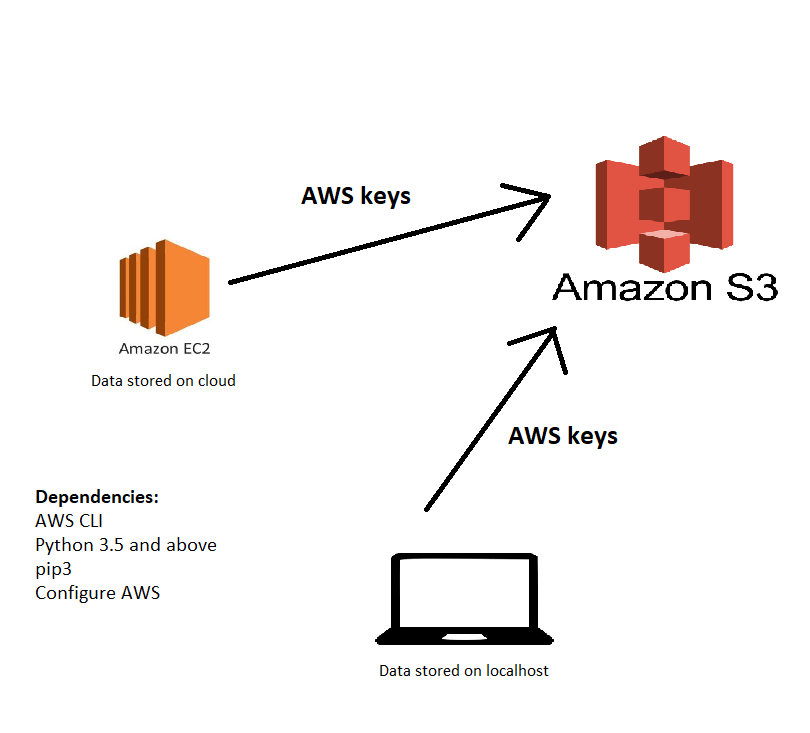

# Simple Storage Service (S3)
To make data persistent highly and globally available<br>
Storage classes depend on the business: 
- S3 standard
- S3 glacier - cheaper

```
sudo apt-get update -y
sudo apt-get upgrade -y
sudo apt-get install python
alias python=python3
python --version
sudo apt-get install python3-pip
python3 -m pip install awscli
aws configure
```
Input keys
Default region: eu-west-1
Default format: json
```
aws s3 ls
aws s3 mb s3://sreviktor
```
Copy a file to S3 bucket:
`aws s3 cp README.md s3://sreviktor/README.md`

Copy from S3 bucket:
`aws s3 cp s3://sreviktor/file .`

Update or synchronise bucket with a directory:
`aws s3 sync . s3://sreviktor/`

Delete a bucket along with the files in it:
`aws s3 rb s3://sreviktor --force`

## Python Boto3
### Install:
`pip3 install boto3`
